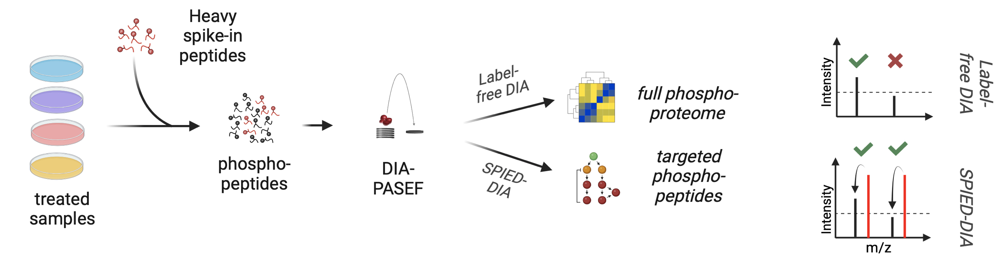
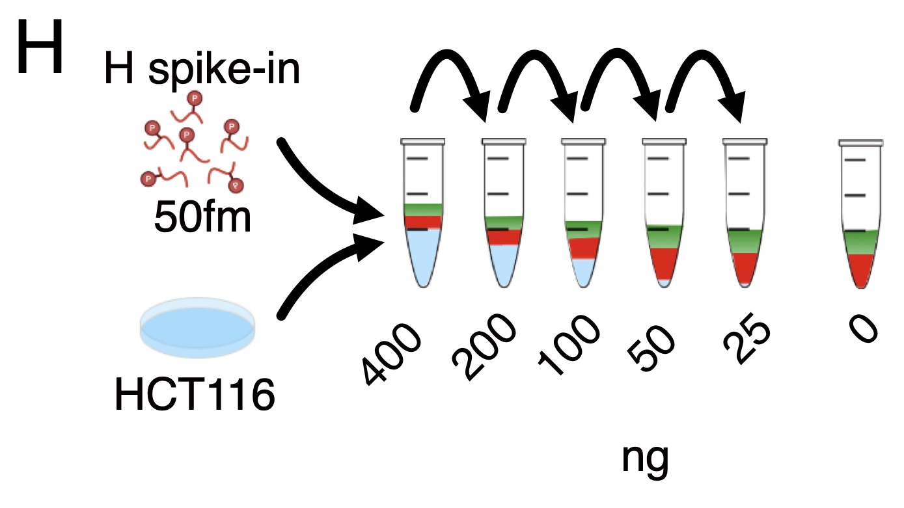
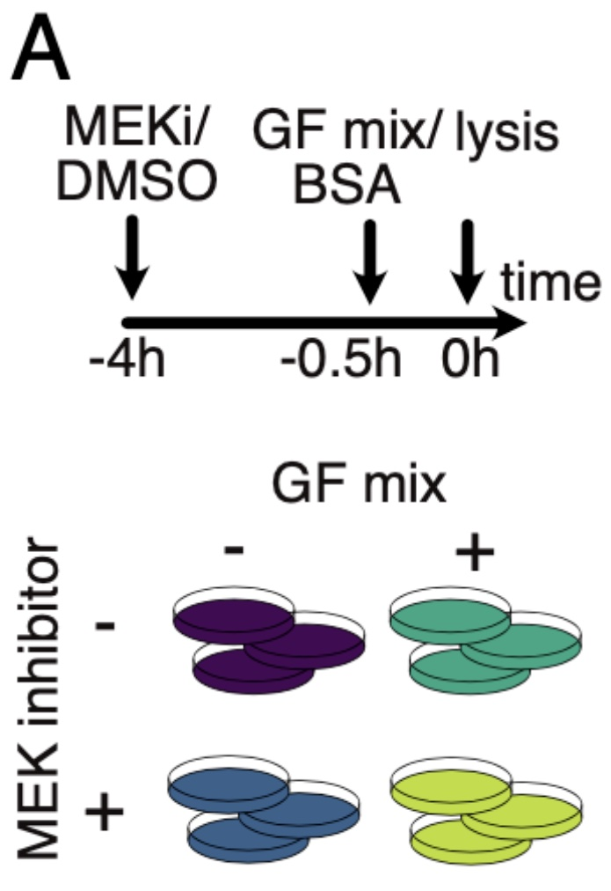
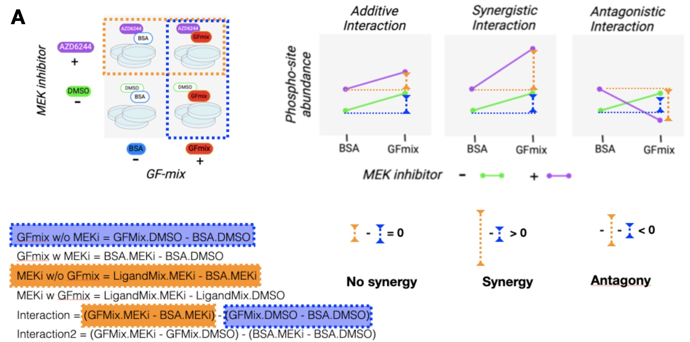

# SPIED-DIA

SPIED-DIA is a method described in our manuscript: [SPIED-DIA Manuscript](https://www.biorxiv.org/content/10.1101/2024.05.13.593849v1).

This GitHub repository includes key scripts necessary to perform SPIED-DIA analysis, as well as the scripts to perform the analyses relevant to the main figures in the manuscript.

## Repository Structure

### Key Scripts for SPIED-DIA Analysis
- **Transform MaxQuant Output**
  - Transforms output from MaxQuant to a DIA-NN compatible spectral library.
- **SPIED-DIA Identification & Quantification**
  - Performs SPIED-DIA identification and quantification from DIA-NN output.
  - **Note:** Specific filter settings (e.g., number of samples per group, threshold for medium confidence identification in light) need to be set manually.

### Manuscript Analysis Scripts
  - Ensure that the coding and analyses from the manuscript can be replicated.
  - Includes:
    - Application of the SPIED-DIA workflow.
    - Specifics on how linear modeling is used to calculate synergy.
    - Significance filtering.
    - Enrichment analysis.
  - **Note:** Paths and dependencies might need to be corrected and set manually for the scripts to work correctly.

#### Folder Structure
- **Benchmark 3: Targeted Dilution Series**
  
  
  
  - Scripts for performing a dilution series of heavy synthetic peptides in light HEK293 (diluted) performed in an *E. coli* background.
  
- **Biological Data Analysis**
  
  
  
  - **CellLine-Panel Analysis - Targeted**
    - SPIED-DIA identification/quantification.
    - Differential expression analysis (including limma setup).
    - Visualization.
  
  - **CellLine-Panel Analysis - Global**
    - **Filter/Normalize & Visualize**
      - PCA scripts
    - **Differential Expression**
    - **Cluster/Kinase Enrichment**
      - **Note:** Relies on PTMsigDB and iKiP-DB

## General Analysis Workflow (As Described in the Manuscript)

Based on DIA-NN version 1.8.2 beta 11

After acquiring raw data: 
- **Perform SPIED-DIA analysis:**
  - Configure DIA-NN settings with the target library.
    - Spectral library: Targeted
    - Missed cleavages: 2, max varmod: 5
Ox(M), Ac(N-term), Phospho -> ON
    - Additional options:
      -   --report-lib-info
      -   --lib-fixed-mod SILAC
      -   --fixed-mod SILAC,0.0,KR,label
      -   --channels SILAC,L,KR,0:0; SILAC,H,KR,8.014199:10.008269
      -   --peak-translation
      -   --mod Acetyl (N-term),42.010565
    -   
all else: default
    -   No MBR! 
  - DIA-NN output:
    - DIA-SPIED identification/quantification.
    - Normalization using loess.
  - Conduct differential expression analysis using limma.

- **Global Analysis:**
  - Configure DIA-NN settings with the HpH library.
    - Spectral library: HpH or PredLib
Ox(M), Ac(N-term), Phospho -> ON
    - Additional options:
      -  --report-lib-info
      -  --mod Acetyl (N-term),42.010565
    -  No MBR in manuscript but MBR also performs good
  - DIA-NN output:
    - Standard filtering.
    - Loess normalization.
  - Conduct differential expression analysis using limma.
    - Cluster and visualize significantly regulated clusters (F-test p-value < 0.1).
      - Perform kinase signature enrichment using Fisher’s exact test on interesting clusters against PTMsigDB and iKip-DB signatures.
      - Manual inspection of clusters.
    - Analysis of limma t-test results per coefficient.
      - Conduct PTM-SEA on PTMsigDB and iKiP-DB signatures.
      - Perform S/T Kinase Motif Library (Cantley et al.) enrichment analysis.

## Synergy Testing Details

- **Concept of Synergy:**
  - Synergy is defined as interactions where combined effects exceed individual effects (e.g., 1 + 1 = 3).

- **Testing Approach:**
  - Utilize specific contrasts to evaluate synergy.
  - This approach allows for detailed examination of regulation in specific cases.

- **Example:**
  - In *Caco2* cells, the coefficient for MEKi with GFmix indicates RAF-MEK-ERK independent signaling in response to GFmix.

## Data Availability

- **Raw Files & Intermediate Tables:**
  - Available on PRIDE: [PRIDE Dataset ID](https://www.ebi.ac.uk/pride/archive/projects/)
## Data Overview PRIDE

### Spectral Libraries

| **Dataset** | **Description** | **Included Files** |
|-------------|-----------------|---------------------|
| **Dataset 1: HpH Fractionated HCT116 Library** | Used for analysis of datasets 3, 4, 6 | - Raw data (`HpHLib_Rawfiles.zip`) - MQ txt (`HpHLib_MQtxtFolder.zip`) - Spectral Library - DIA-NN compatible (`HpHLib_SpecLib.csv`) - FASTA (`uniprot_HS_Jun2023_CanonicalOnly.fasta`) |
| **Dataset 2: Targeted Libraries** | Three targeted libraries used in this manuscript (overview targets per library in Supplementary Table 1) | - **Per Library:**   &nbsp;&nbsp;- Raw data   &nbsp;&nbsp;- MQ output   &nbsp;&nbsp;- Spectral library - DIA-NN compatible   &nbsp;&nbsp;- General: FASTA (`SyntheticPeptides.fasta`) - **List Files:**   &nbsp;&nbsp;- Benchmark 2 - Analysis Dataset 4 (`TargetLibBM2_Rawfiles.zip`, `TargetLibBM2_MQtxtFolder.zip`, `TargetLib_BM2.csv`)   &nbsp;&nbsp;- Dilution Series (Targeted dilution series): Analysis Dataset 5 (`Lib_Benchmark3_Rawfiles.zip`, `Lib_Benchmark3_MQtxt.zip`, `Lib_Benchmark3.csv`)   &nbsp;&nbsp;- Biological Data: Analysis Datasets 6 & 7 (`Lib_BioData_Rawfiles.zip`, `Target_SpecLib1_MQtxtFolder.zip`, `Target_SpecLib1.csv`) |
| **Predicted Library** | Used in analysis of dataset 4 | - FASTA (`uniprot_HS_Jun2023_CanonicalOnly.fasta`) - Spectral library and DIA-NN log file (`PredLib.zip`) |

### Technical Benchmarks
Data related to technical benchmarks performed in this study.

| **Dataset** | **Description** | **Included Files** |
|-------------|-----------------|---------------------|
| **Dataset 3: Benchmark Full Phosphodilution** | Source data for Figure 1C, D, E, S1A, B, C, D | - Raw data (`Benchmark1_Rawfiles.zip`) - DIA-NN output - analyzed with HpH library (`Benchmark1_outputDIANN.zip`) |
| **Dataset 4: Benchmark 2** | Source data for Figure 1G, S1E | - Raw data (`Benchmark2_Rawfiles.zip`) - DIA-NN output - collected (`Benchmark2_outputDIANN_collected.zip`) - MQ output (`TargetLibBM2_MQtxtFolder.zip`) |
| **Dataset 5: Targeted Dilution Series** | Source data for Figure 1H, S3, S4, S5 | - Raw data (`Rev_Benchmark3_Rawfiles.zip`) - DIA-NN output - SPIED-DIA (`Rev_Benchmark3_DIANNoutput.zip`) |

### Biological Data
Data related to biological datasets analyzed in this study.

| **Dataset** | **Description** | **Included Files** |
|-------------|-----------------|---------------------|
| **Dataset 6: Cell Line Panel GFmix** | Source data for Figures 3B, C, D, 4D, 5, S10, S11, S12, S13, S14 | - Raw data (`PanelGFmix_Rawfiles.zip`) - DIA-NN output label-free - analyzed with HpH library (`PanelGFmix_outputDIANN_LF.zip`) - DIA-NN output SPIED-DIA - analyzed with spectral library BioData (`PanelFGmix_outputDIANN_SPIED.zip`) |
| **Dataset 7: HCT116 Individual GFs** | Source data for Figures S15, S16 | - Raw data (`HCT116GFs_Rawfiles.zip`) - DIA-NN output Label-free (`HCT116GFs_outputDIANN_LF.zip`) - DIA-NN output SPIED-DIA (`HCT116GFs_outputDIANN_SPIED.zip`) |

 
